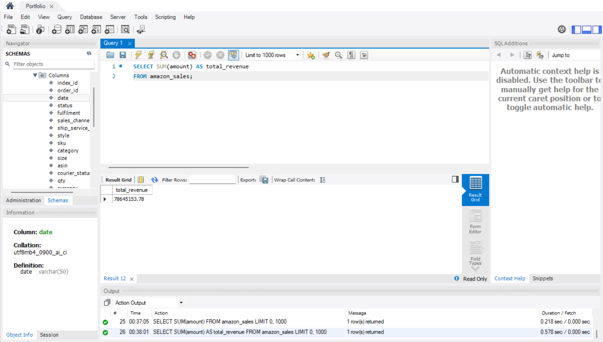

# Amazon_sales (WIP)
This is my second SQL portfolio project. I am using the Amazon Sales dataset from Kaggle to practice more challenging SQL queries. The goal of this project is to strengthen my SQL skills in data cleaning, aggregation, and business analysis by exploring sales trends, customer behavior, and product performance.

# Data Preparation
- DATE column has invalid data type SQL format. When importing the dataset, I have to choose VARCHAR data type for DATE column.
- The format from the dataset is %m-%d-%y whilst SQL can only read %y-%m-%d format on MySQL
- In order to change, I have to add a column helper called date_new DATE
- Then I have to convert old VARCHAR date column to DATE using STR_TO_DATE(date, '%m-%d-%y')
- Lastly, I drop old VARCHAR date and rename date_new to date.

## Screenshot of new column added

## Screenshot of STR_TO_DATE(date, '%m-%d-%y')

## Screenshot of final result

# Beginner Sample Queries 

## 1. Total Amount of Revenue
SELECT SUM(amount) AS total_revenue
FROM amazon_sales;

### Screenshot of Total Revenue

### Explanation
I used SUM to calculate the total amount. In this case, total amount means total sales that Amazon made according to the dataset. 

## 2. Total Item Sold
SELECT SUM(qty) AS total_item_sold
FROM amazon_sales;

### Screenshot of Total Item Sold

### Explanation
I used SUM to add all item sold. As per dataset, the column QTY shows how many items have been sold. Since some of the row has 0 qty, I couldn't use SELECT COUNT(*) query to find total item sold.

## 3. Best-Selling Product
SELECT category AS product, SUM(qty) AS total_item_sold
FROM amazon_sales
GROUP BY category
ORDER BY total_item_sold DESC;

### Screenshot of Best-Selling Product

### Explanation
To find the best-selling product, I selected the column representing the product which is category. After that, I need to SUM the total number of item sold. In this case, the column is QTY. Once I did that, I need to group by the list of product and order by the highest to the lowest (DESC). Additionally, if the employee ask for top 5 best selling product, simply add LIMIT 5 after ORDER BY clause.
