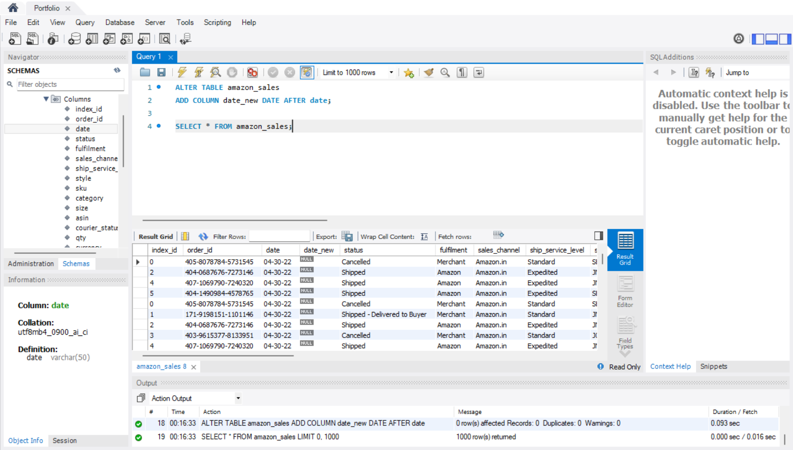
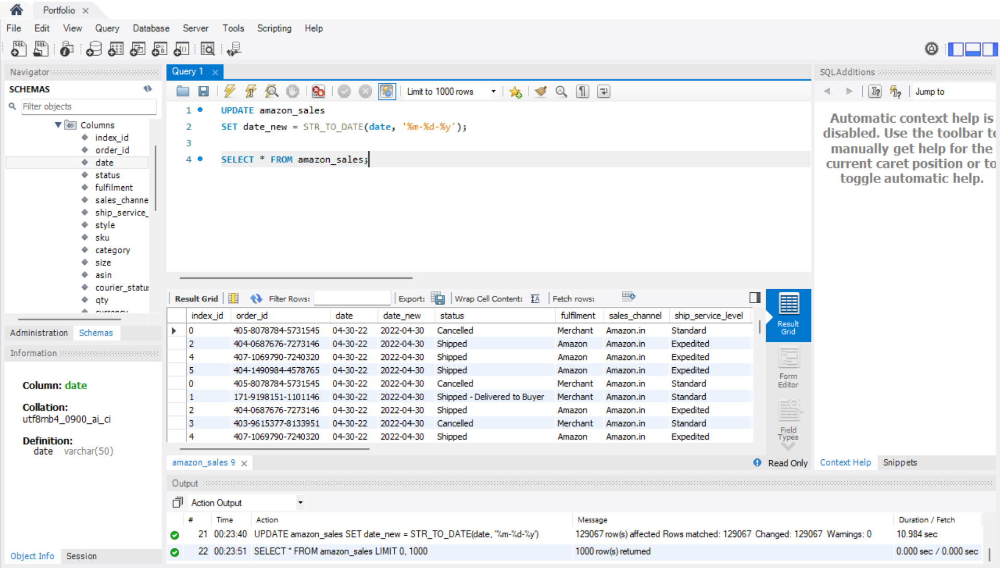
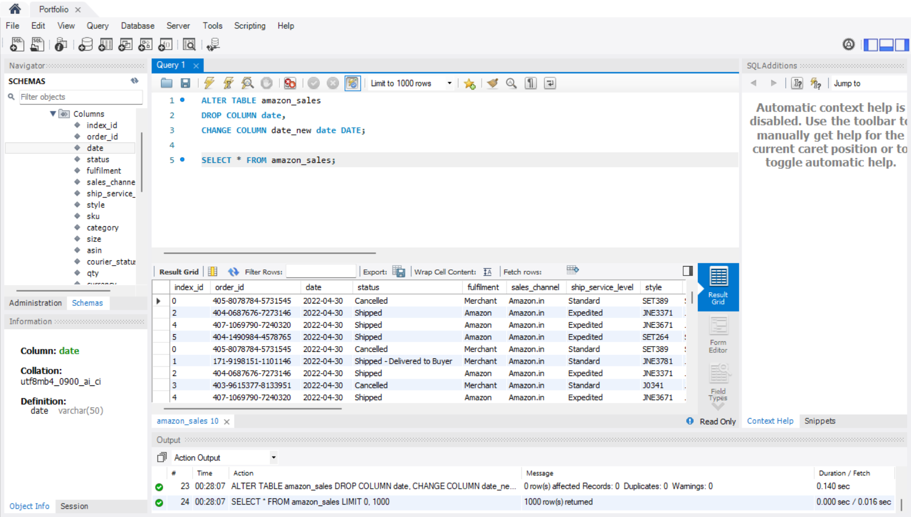
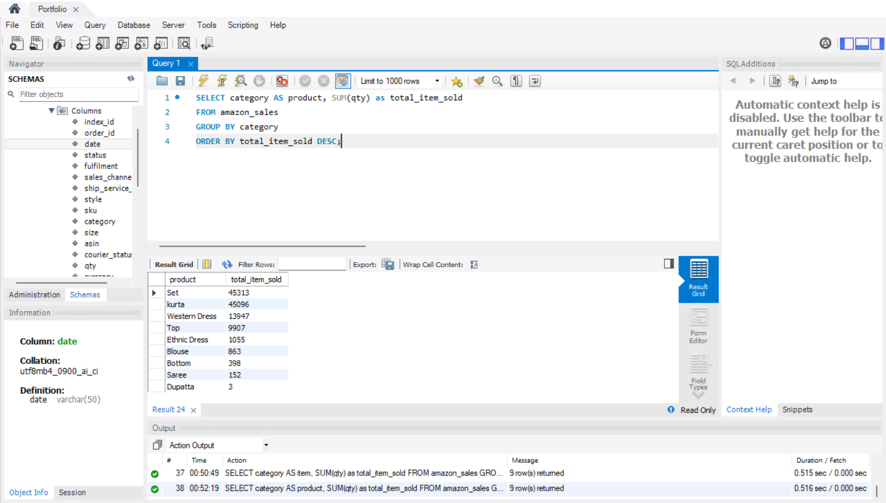
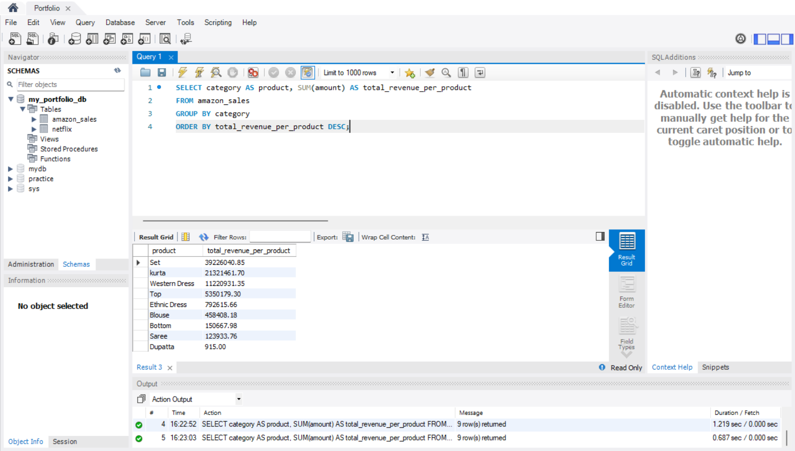
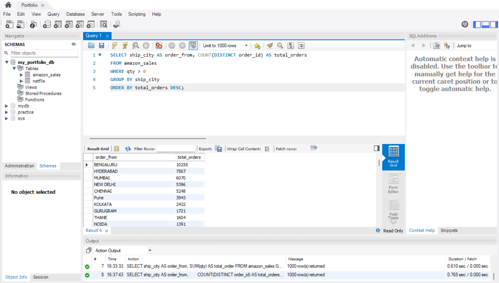
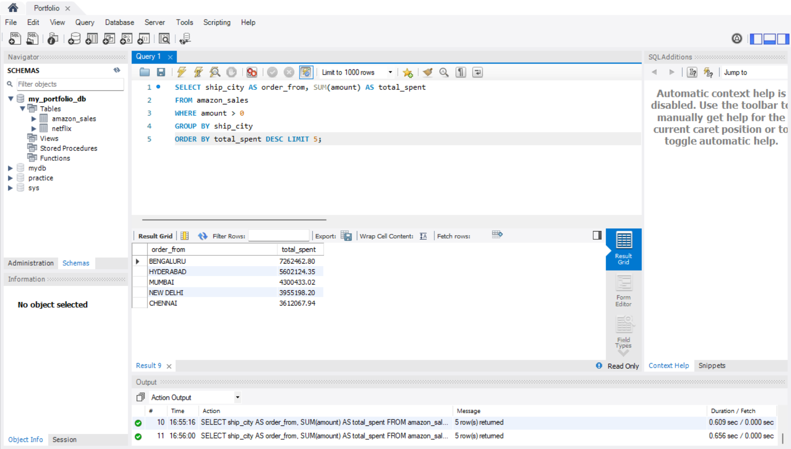
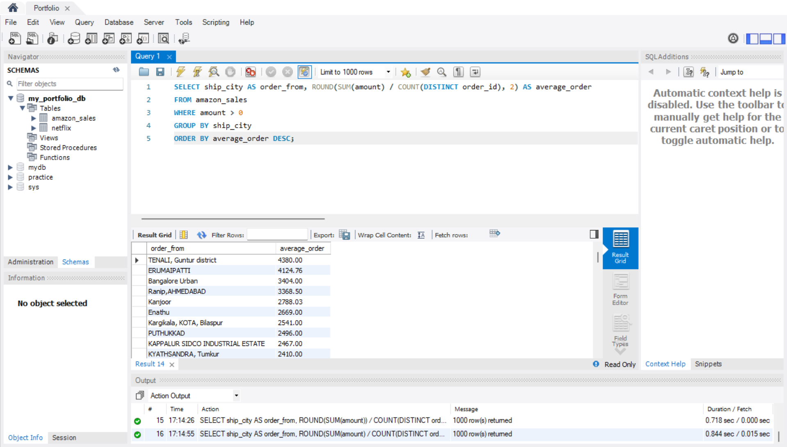
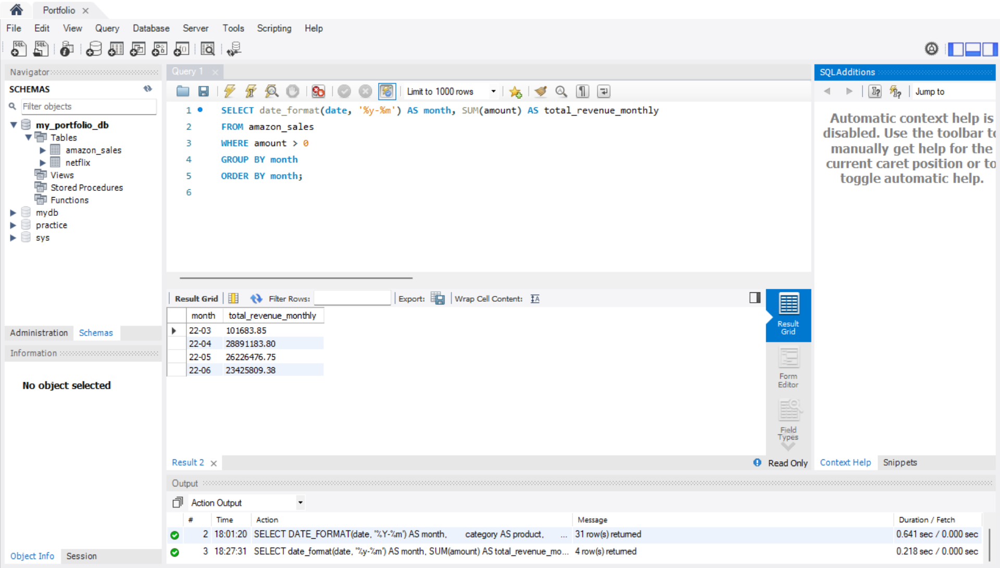

# Amazon_sales (WIP)
This is my second SQL portfolio project. I am using the Amazon Sales dataset from Kaggle to practice more challenging SQL queries. The goal of this project is to strengthen my SQL skills in data cleaning, aggregation, and business analysis by exploring sales trends, customer behavior, and product performance.

# Short Description about the Dataset
The dataset contains X rows and Y columns, with fields such as order_id, date, category, ship_city, qty, and amount. This project focuses on analyzing product sales, revenue, and customer location trends. I couldn't upload the dataset because the size is more than 25MB.

# Data Preparation
- DATE column has invalid data type SQL format. When importing the dataset, I have to choose VARCHAR data type for DATE column.
- The format from the dataset is %m-%d-%y whilst SQL can only read %y-%m-%d format on MySQL
- In order to change, I have to add a column helper called date_new DATE
- Then I have to convert old VARCHAR date column to DATE using STR_TO_DATE(date, '%m-%d-%y')
- Lastly, I drop old VARCHAR date and rename date_new to date.

## Screenshot of new column added

## Screenshot of STR_TO_DATE(date, '%m-%d-%y')

## Screenshot of final result

# Sample Queries 

## 1. Best-Selling Product
SELECT category AS product, SUM(qty) AS total_item_sold
FROM amazon_sales
GROUP BY category
ORDER BY total_item_sold DESC;

### Screenshot of Best-Selling Product

### Explanation
To find the best-selling product, I selected the column representing the product which is category. After that, I need to SUM the total number of item sold. In this case, the column is QTY. Once I did that, I need to group by the list of product and order by the highest to the lowest (DESC). Additionally, if the employee ask for top 5 best selling product, simply add LIMIT 5 after ORDER BY clause.

### Insight
Set product is Amazon's best selling product. Comes very close in second is Kurta. Amazon can focus more on these two products.

## 2. Total Revenue for Each Product
SELECT category AS product, SUM(amount) AS total_revenue_per_product
FROM amazon_sales
GROUP BY category
ORDER BY total_revenue_per_product DESC;

### Screenshot of Total Revenue for Each Product

### Explanation
This is similar practice to query 1. The difference is this query is to find total revenue made by each product.

### Insight
Set brings the most revenue for the company. 

## 3. Total Order from Each Location
SELECT ship_city AS order_from, COUNT(DISTINCT order_id) AS total_orders
FROM amazon_sales
WHERE qty > 0
GROUP BY ship_city
ORDER BY total_orders DESC;

### Screenshot of Total Order from Each Location

### Explanation
This query shows total number of order coming from each location. Some order_id has 0 in qty. Probably cause by customers cancelled the order. That is why we need to look for order_id that has data more than 0 in qty (WHERE > 0). Besides that, there are multiple duplicate order_id. For that reason, we need to use DISTINCT to ensure MySQL does not count duplicate order_id.

### Insight
From the query, we can conclude that the highest demand comes from Bengaluru.

## 4. Top 5 Total Spent from Location
SELECT ship_city AS order_from, SUM(amount) AS total_spent
FROM amazon_sales
WHERE amount > 0
GROUP BY ship_city
ORDER BY total_spent DESC LIMIT 5;

### Screenshot of Top 5 Total Spent from Location

### Explanation
The structure of query looks the same to query 3. However, query 4 focus on top 5 location that spent the most on amazon_sales. Due to that, I use LIMIT 5 because we only require top 5 location. 

### Insight
From this query, we can conclude that customers from Bengaluru spent the most.  It shows that the business has huge demand over there.

## 5. Average Order per Location
SELECT ship_city AS order_from, ROUND(SUM(amount) / COUNT(DISTINCT order_id), 2) AS average_order
FROM amazon_sales
WHERE amount > 0
GROUP BY ship_city
ORDER BY average_order DESC;

### Screenshot of Average Order per Location

### Explanation
This query shows average order from customers per location. Total spent is calculated by SUM the amount in the dataset and determine how many order_id. Divide those two will give us average money spent per order. It is also grouped by location to know which location has customers that willing to spend a lot of money. I rounded the answer to two decimal to make it easy to read the data. 

### Insight
From the analysis, a location like Bengaluru may have the highest spent customers but lower average whilst the highest average comes from Tenali which indicate that this place has fewer order but higher revenue.

## 6. Monthly Revenue Trend
SELECT date_format(date, '%y-%m') AS month, SUM(amount) AS total_revenue
FROM amazon_sales
WHERE amount > 0
GROUP BY month
ORDER BY month

### Screenshot of Monthly Revenue Trend

### Explanation
In order to find monthly revenue trend, we need to use date_format(date, '%y-%m') AS month. This means we only want the query to show year and month from the date. By doing this, we can see each month data. To check total revenue, as usual, use SUM(amount). Group and order by month to check monthly trend.

### Insight
Amazon's lowest revenue is in March, 2022 and most revenue comes from April, 2022. In May and June, 2022, the trend seems to be in downward but not drastically decrease.

# Conclusion
Analysis of the Amazon Sales dataset reveals that Set and Kurta are the top-performing products in both sales and revenue. Bengaluru leads in total orders and spending, while Tenali has fewer orders but the highest average order value, indicating a premium market. Revenue peaked in April 2022 and was lowest in March, suggesting seasonal trends. These insights highlight key markets and products to focus on for growth and targeted strategies.
